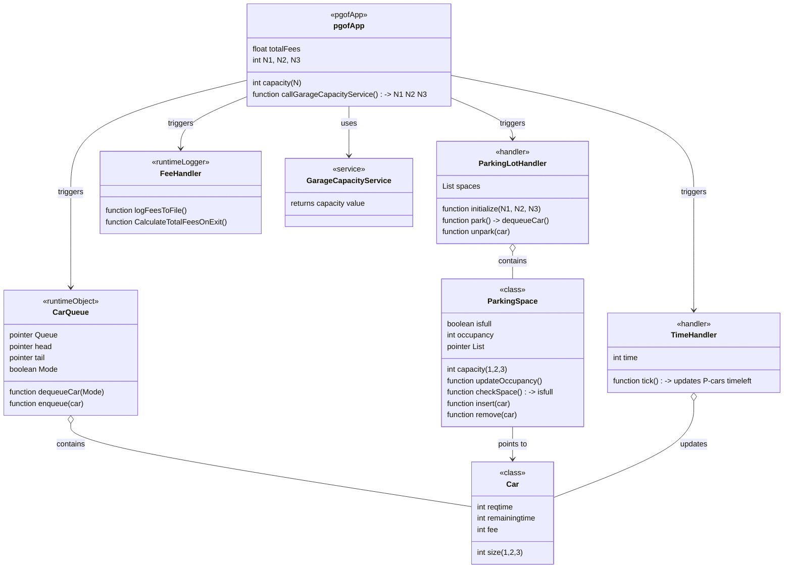
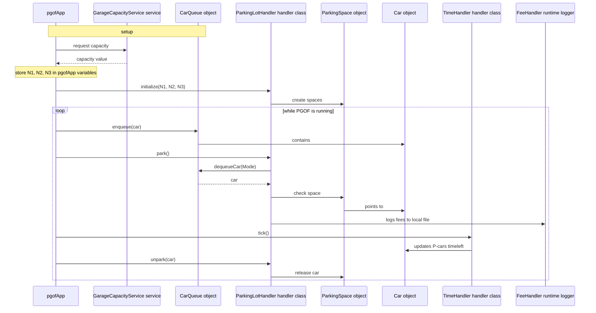

# PGOF Definition Of Done

PGOF is complete when the system supports these top-level use cases:

1. Start the garage and discover the current number of parking spaces.
2. Split the garage capacity across size-1, size-2, and size-3 parking spaces.
3. Accept autonomous vehicles into a waiting line in order of arrival.
4. Track each vehicle's size and requested parking duration.
5. Park vehicles into compatible empty spaces according to the PGOF parking rules.
6. When the next vehicle in line cannot be parked, select the first eligible waiting vehicle that can be parked.
7. Return to arrival-order parking once compatible spaces are available again.
8. Unpark vehicles when their requested parking duration expires.
9. Charge each parked vehicle using `fee = car_size * parking_time`.
10. Maintain the total fees collected over the run.
11. Maintain the total number of vehicles successfully parked.
12. Prefer parking decisions that maximize collected fees over a long-running operating period.

## Base UML

## Base Sequence

# Sequence of events of PGOF System
