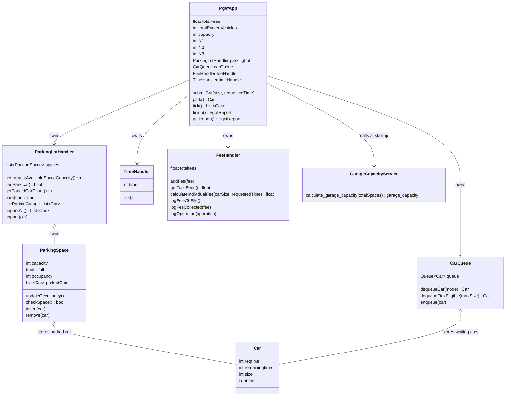
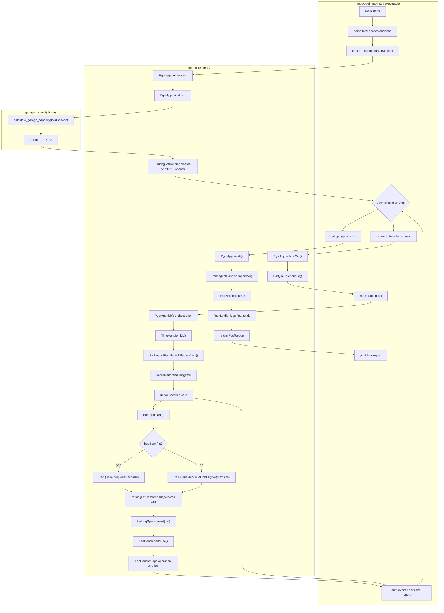
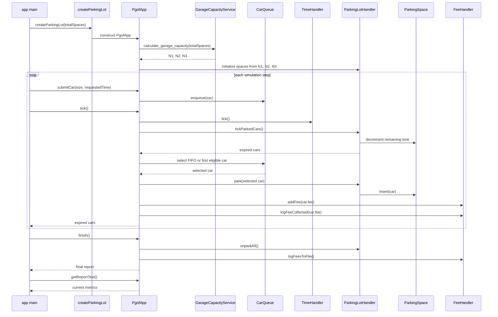

# PGOF Design And Definition Of Done
# By: Santiago Ugarte

All Design and implementation over this Problem was done by Santiago Ugarte.

PGOF is a C++ library plus a small demonstration executable for the Parking
Garage of the Future problem. The library owns the parking lot state, queue,
time advancement, parking policy, fee tracking, and reporting. The executable is
only a client that creates a garage instance, submits arrivals, advances time,
and prints reports.

## Definition Of Done

PGOF is complete when the system supports these top-level use cases:

1. Start the garage and discover the current number of parking spaces.
2. Split the garage capacity across size-1, size-2, and size-3 parking spaces.
3. Accept autonomous vehicles into a waiting line in order of arrival.
4. Track each vehicle's size and requested parking duration.
5. Park vehicles into compatible empty spaces according to the PGOF parking rules.
6. When the next vehicle in line cannot be parked, select the first eligible waiting vehicle that can be parked.
7. Return to arrival-order parking once compatible spaces are available again.
8. Unpark vehicles when their requested parking duration expires.
9. Charge each parked vehicle using `fee = car_size * parking_time`.
10. Maintain the total fees collected over the run.
11. Maintain the total number of vehicles successfully parked.
12. Prefer parking decisions that maximize collected fees over a long-running operating period.

## Public Boundary

The application entry point does not implement parking rules. It uses the PGOF
library through this boundary:

1. `pgof::createParkingLot(totalSpaces)` creates an independent garage instance.
2. `PgofApp::submitCar(size, requestedTime)` submits autonomous vehicle arrivals.
3. `PgofApp::tick()` advances the system by exactly one time unit.
4. `PgofApp::finish()` ends the run, unparks all parked cars, clears waiting cars, and logs final totals.
5. `PgofApp::getReport()` and `PgofApp::getReportText()` expose state for clients.

Each `PgofApp` instance is independent. Creating several garages through the
factory gives several independent parking lots, each with its own capacity split,
queue, clock, parked cars, total fees, and parked vehicle count.

## Runtime Rules

### Capacity

At startup, `PgofApp` calls the garage capacity service:

- Input: total spaces `N`.
- Valid range: `10 <= N <= 1000000`.
- Output: `N1`, `N2`, and `N3`, split as evenly as possible.
- `ParkingLotHandler` creates exactly `N1 + N2 + N3` parking spaces.

### Cars

Cars have:

- `size` in `{1, 2, 3}`.
- `reqtime`, the requested parking duration.
- `remainingtime`, decremented on each tick while parked.
- `fee`, calculated when the car is successfully parked.

The problem statement defines requested parking durations as `{1..10}`. The
current library API expects callers to submit values inside this domain.

### Parking Spaces

Parking spaces have:

- `capacity` in `{1, 2, 3}`.
- `occupancy`, equal to the parked car size or `0` when empty.
- `isfull`, true when a car is parked.
- owned parked-car storage.

Each parking space holds at most one car. A car is compatible with a space when:

```text
car.size <= space.capacity
```

Compatible states are:

- size-1 space: empty or one size-1 car.
- size-2 space: empty or one size-1 or size-2 car.
- size-3 space: empty or one size-1, size-2, or size-3 car.

### Queue Policy

Autonomous vehicles join the waiting queue in arrival order.

On a parking attempt:

1. If the head car can fit in any empty compatible space, park the head car.
2. If the head car cannot fit, select the first later waiting car that can fit.
3. Skipped cars remain in queue in their original relative order.
4. When compatible space is available for the head car again, FIFO parking resumes.
5. If no waiting car can fit, no car is parked on that attempt.

This policy satisfies the design's first-eligible fallback rule. It is the scoped
fee-preference strategy currently implemented: it avoids leaving compatible
empty spaces unused when the head car blocks the queue.

### Time Advancement

`PgofApp::tick()` is the library's one-step orchestration call. It performs this
sequence:

1. Increment system time through `TimeHandler`.
2. Decrement `remainingtime` for every parked car.
3. Unpark all cars whose `remainingtime <= 0`.
4. Attempt to park one waiting car according to the queue policy.
5. Return the cars that expired and were unparked during the tick.

The executable can call `tick()` repeatedly to simulate a long-running operating
period.

### Shutdown

`PgofApp::finish()` ends a run. It performs this sequence:

1. Log that shutdown has started.
2. Unpark every currently parked car.
3. Clear cars still waiting in line.
4. Preserve the total fees already collected at parking time.
5. Log the final fee total and final operation summary.
6. Return a final `PgofReport`.

Shutdown does not charge parked cars again. Fees are collected when a car is
successfully parked, so charging again during shutdown would double-count.

### Fees

Fees are charged when a car is successfully parked:

```text
fee = car_size * parking_time
```

The fee is stored on the parked car and added to the running total. The system
also increments the total number of successfully parked vehicles.

Runtime fee totals are maintained in memory by `FeeHandler`.

### Logging

PGOF writes simple append-only runtime logs:

- `fees.log` records collected fees, running totals, and final total.
- `operations.log` records initialization, enqueue, tick, park, unpark, and finish operations.

Logging is best-effort. If the log files cannot be opened, PGOF continues running
with in-memory totals and reports.

## Current Architecture



## Workflow And Library Boundaries

This graph shows the full program workflow and the ownership boundary for each
step. `main` drives the demo, the PGOF library owns the garage behavior, and the
garage capacity library owns only the capacity split calculation.



## Runtime Sequence



## Executable Behavior

The `pgof` executable demonstrates the library:

```text
pgof <total-spaces> [ticks]
```

It creates a parking lot through the factory, submits a deterministic arrival
schedule, advances time one tick at a time, prints unpark events, and prints
library reports. At the end of the demo run it calls `finish()` so all parked
cars are released and final fee totals are logged.

## Test Coverage

The current CTest suite verifies:

- garage capacity split and bounds checking.
- startup capacity discovery.
- parking-space creation from capacity split.
- FIFO queue behavior.
- first eligible fallback behavior.
- return to arrival order after fallback.
- car size and requested duration tracking.
- compatible-space-only insertion.
- unparking and occupancy updates.
- time increment.
- tick-driven expiry/unparking.
- individual fee calculation.
- total fee tracking.
- total parked vehicle tracking.
- scoped long-running fee preference through first-eligible parking.
- final shutdown/unpark behavior without double-charging fees.

## Open Design Notes

These are intentionally not expanded beyond the problem scope unless the product
requirements change:

- Strong fee optimization across an entire long-running period is not implemented
  as a global optimizer. The current policy follows the specified first-eligible
  fallback rule.
- `submitCar` currently assumes valid car size and requested duration input.
  Boundary validation can be added if clients may submit invalid values.
